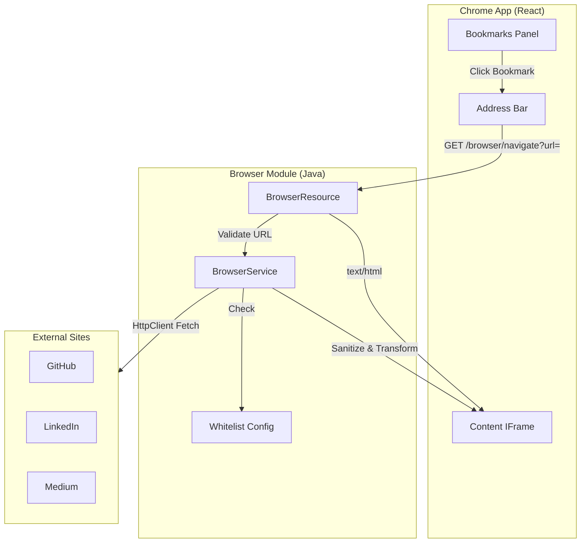

# Design Document: Browser Proxy Subsystem

## Overview

The Browser Proxy Subsystem provides a secure, whitelist-based proxy for displaying external web content within the WebOS portfolio. It consists of a Java backend service that fetches, sanitizes, and transforms HTML content, and a React frontend "Chrome" application that provides the browser interface.

The system operates in "Reader Mode" - fetching external pages, stripping potentially dangerous elements, and serving sanitized HTML that can be safely displayed in an iframe without X-Frame-Options restrictions.

## Architecture



## Components and Interfaces

### Backend Components

#### BrowserService (Control Layer)

Location: `io.webos.portfolio.browser.control.BrowserService`

Responsibilities:
- URL whitelist validation
- External content fetching via HttpClient
- HTML sanitization using Jsoup
- URL rewriting (relative to absolute)
- Custom style injection

```java
public interface BrowserService {
    /**
     * Validates if a URL is in the whitelist.
     * @param url the URL to validate
     * @return true if URL starts with an allowed prefix
     */
    boolean isAllowed(String url);
    
    /**
     * Fetches and sanitizes content from a whitelisted URL.
     * @param url the target URL to proxy
     * @return sanitized HTML content
     * @throws NotFoundException if URL not whitelisted
     * @throws BadGatewayException if external fetch fails
     */
    String fetchAndSanitize(String url);
}
```

#### BrowserResource (Boundary Layer)

Location: `io.webos.portfolio.browser.boundary.BrowserResource`

Responsibilities:
- Expose REST endpoint for navigation
- Handle HTTP response codes
- Content-Type negotiation

```java
@Path("/browser")
@Produces(MediaType.TEXT_HTML)
public class BrowserResource {
    
    @GET
    @Path("/navigate")
    String navigate(@QueryParam("url") String url);
}
```

### Frontend Components

#### ChromeBrowser (React Component)

Location: `webos-ui/src/components/chrome/ChromeBrowser.tsx`

Responsibilities:
- Render browser chrome (address bar, bookmarks, content area)
- Manage navigation state
- Display proxied content in iframe

```typescript
interface ChromeBrowserProps {
    initialUrl?: string;
}

interface Bookmark {
    name: string;
    url: string;
    icon?: string;
}
```

## Data Models

### Backend Entities

#### BrowserConfig (Entity Layer)

Location: `io.webos.portfolio.browser.entity.BrowserConfig`

```java
public record BrowserConfig(
    List<String> allowedPrefixes,
    String userAgent,
    String customStyles
) {
    public static BrowserConfig defaults() {
        return new BrowserConfig(
            List.of(
                "https://github.com/",
                "https://linkedin.com/in/",
                "https://medium.com/@"
            ),
            "Mozilla/5.0 (Windows NT 10.0; Win64; x64) AppleWebKit/537.36",
            """
            body { max-width: 100%; overflow-x: hidden; }
            img { max-width: 100%; height: auto; }
            """
        );
    }
}
```

#### ProxyResult (Entity Layer)

```java
public record ProxyResult(
    String originalUrl,
    String sanitizedHtml,
    int statusCode
) {}
```

### Frontend Types

```typescript
interface NavigationState {
    currentUrl: string;
    isLoading: boolean;
    error: string | null;
}

interface Bookmark {
    id: string;
    name: string;
    url: string;
    favicon?: string;
}
```

## Correctness Properties

*A property is a characteristic or behavior that should hold true across all valid executions of a system—essentially, a formal statement about what the system should do. Properties serve as the bridge between human-readable specifications and machine-verifiable correctness guarantees.*

### Property 1: URL Whitelist Validation

*For any* URL string and *for any* whitelist of URL prefixes, the `isAllowed` function returns `true` if and only if the URL starts with at least one prefix in the whitelist.

**Validates: Requirements 1.2, 1.3**

### Property 2: Dangerous Tag Removal

*For any* valid HTML string containing `<script>`, `<iframe>`, `<object>`, or `<embed>` tags, the sanitized output shall contain zero instances of these tags while preserving all other HTML structure.

**Validates: Requirements 3.2, 3.3, 3.4, 3.5**

### Property 3: Relative URL Rewriting

*For any* valid HTML string containing relative URLs (in `src`, `href`, or `action` attributes) and *for any* valid base URL, all relative URLs in the sanitized output shall be converted to absolute URLs using the base URL.

**Validates: Requirements 4.1**

### Property 4: Style Injection Presence

*For any* valid HTML string, the sanitized output shall contain exactly one injected `<style>` block with the configured custom styles.

**Validates: Requirements 5.1**

### Property 5: Proxy URL Construction (Frontend)

*For any* virtual URL displayed in the address bar, the iframe `src` attribute shall be constructed as `/browser/navigate?url={encodedVirtualUrl}`.

**Validates: Requirements 7.2**

## Error Handling

### Backend Error Handling

| Scenario | HTTP Status | Response |
|----------|-------------|----------|
| URL not in whitelist | 404 Not Found | `{"error": "404 Not Found"}` |
| External site unreachable | 502 Bad Gateway | `{"error": "502 Bad Gateway"}` |
| External site returns error | 502 Bad Gateway | `{"error": "502 Bad Gateway"}` |
| Invalid URL format | 400 Bad Request | `{"error": "Invalid URL"}` |

### Exception Hierarchy

```java
// Use JAX-RS WebApplicationException subclasses
NotFoundException      // 404 - URL not whitelisted
BadRequestException    // 400 - Invalid URL format
// Custom exception for 502
public class BadGatewayException extends WebApplicationException {
    public BadGatewayException(String message) {
        super(message, Response.Status.BAD_GATEWAY);
    }
}
```

### Frontend Error Handling

- Display backend error responses directly in the iframe
- Show loading indicator during fetch operations
- Provide user-friendly error messages in the UI chrome

## Testing Strategy

### Property-Based Testing (jqwik)

Property-based tests will be implemented using jqwik (already configured in pom.xml) with minimum 100 iterations per property.

**Test Configuration:**
- Framework: jqwik 1.9.2
- Assertions: AssertJ 3.26.3
- Minimum iterations: 100 per property

**Property Tests to Implement:**

1. **WhitelistValidationProperties** - Tests for Property 1
   - Generate random URLs and whitelists
   - Verify isAllowed behavior matches specification

2. **HtmlSanitizationProperties** - Tests for Properties 2, 3, 4
   - Generate random HTML with dangerous tags
   - Verify all dangerous tags removed
   - Generate HTML with relative URLs
   - Verify URL rewriting correctness
   - Verify style injection

### Unit Tests

Unit tests complement property tests for specific examples and edge cases:

- Empty URL handling
- Malformed HTML handling
- Empty whitelist behavior
- URL encoding edge cases
- Style injection with existing style tags

### Integration Tests

- End-to-end proxy flow with mocked external responses
- Error response format verification
- Content-Type header verification

## Dependencies

### Backend (Add to pom.xml)

```xml
<dependency>
    <groupId>org.jsoup</groupId>
    <artifactId>jsoup</artifactId>
    <version>1.17.2</version>
</dependency>
```

### Frontend

No additional dependencies required - uses existing React, TypeScript, and Tailwind CSS stack.

