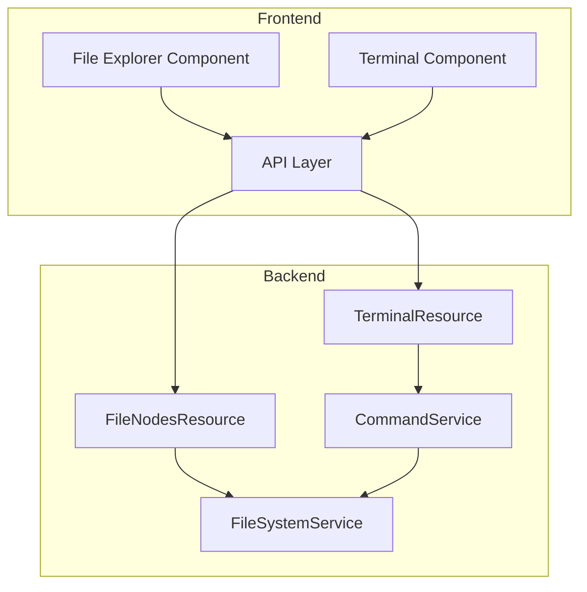

# Design Document: File Explorer

## Overview

This design describes a functional File Explorer for WebOS Portfolio with integrated terminal commands. The system extends the existing virtual file system to support mutable operations (create, delete) while maintaining the in-memory MFT architecture. The File Explorer GUI provides visual navigation, and terminal commands (`mkdir`, `cat`, `cd`, `touch`, `rm`, `pwd`) enable CLI-based file management.

## Architecture



The architecture follows BCE pattern:
- **Boundary**: FileNodesResource, TerminalResource (JAX-RS endpoints)
- **Control**: FileSystemService, CommandService (business logic)
- **Entity**: FileNode, CommandResult (data records)

## Components and Interfaces

### Backend Components

#### FileSystemService (Enhanced)

The existing FileSystemService is enhanced to support mutable operations:

```java
@ApplicationScoped
public class FileSystemService {
    // Mutable MFT - changed from immutable List to mutable ArrayList
    List<FileNode> mft = new ArrayList<>(initialNodes());
    
    // Existing read operations
    List<FileNode> findByParentId(String parentId);
    Optional<FileNode> findById(String id);
    
    // New write operations
    FileNode createNode(String parentId, String name, FileType type, String content);
    boolean deleteNode(String id);
    boolean deleteNodeRecursive(String id);
    Optional<FileNode> findByNameInParent(String parentId, String name);
    String buildPath(String nodeId);
}
```

#### CommandService (Enhanced)

Extended to support new commands with current directory state:

```java
@ApplicationScoped  
public class CommandService {
    @Inject FileSystemService fileSystemService;
    
    // Current directory context (session-scoped in real impl)
    String currentDirectory = "desktop";
    
    CommandResult execute(String input);
    
    // Command handlers
    CommandResult mkdir(String[] parts);
    CommandResult touch(String[] parts);
    CommandResult rm(String[] parts);
    CommandResult cd(String[] parts);
    CommandResult pwd(String[] parts);
    CommandResult cat(String[] parts);  // Enhanced
    CommandResult ls(String[] parts);   // Enhanced
}
```

### Frontend Components

#### FileExplorer Component

```typescript
interface FileExplorerProps {
  onClose: () => void
}

interface FileExplorerState {
  currentPath: string[]           // Breadcrumb path
  currentParentId: string         // Current directory ID
  nodes: FileNode[]               // Current directory contents
  selectedNode: FileNode | null   // Selected file/folder
  previewContent: string | null   // File preview content
}
```

#### API Extensions

```typescript
// New API functions
async function createDirectory(parentId: string, name: string): Promise<FileNode>
async function createFile(parentId: string, name: string): Promise<FileNode>
async function deleteNode(id: string): Promise<void>
async function getNodeContent(id: string): Promise<string>
```

## Data Models

### FileNode (Existing - No Changes)

```java
public record FileNode(
    String id,
    String parentId,
    String name,
    FileType type,
    String content
)
```

### CommandResult (Existing - No Changes)

```java
public record CommandResult(
    boolean success,
    String output,
    String error
)
```

### Terminal Session State

```java
// Managed per-session for current directory tracking
public record TerminalSession(
    String sessionId,
    String currentDirectory
)
```

## Correctness Properties

*A property is a characteristic or behavior that should hold true across all valid executions of a system—essentially, a formal statement about what the system should do. Properties serve as the bridge between human-readable specifications and machine-verifiable correctness guarantees.*

### Property 1: Directory Navigation Displays Correct Contents

*For any* directory in the file system, when navigated to, the File Explorer SHALL display exactly the FileNodes whose parentId matches that directory's id.

**Validates: Requirements 1.2**

### Property 2: File Icons Match FileNode Types

*For any* FileNode displayed in the File Explorer, the icon rendered SHALL correspond to the FileNode's type (DIRECTORY, FILE, or SHORTCUT).

**Validates: Requirements 1.6**

### Property 3: mkdir Creates Directory in MFT

*For any* valid directory name and existing parent directory, executing `mkdir <name>` SHALL result in a new FileNode of type DIRECTORY being added to the MFT with the correct parentId.

**Validates: Requirements 2.1, 2.4**

### Property 4: cat Returns File Content

*For any* FileNode of type FILE with non-null content, executing `cat <id>` SHALL return exactly that file's content string.

**Validates: Requirements 3.1**

### Property 5: cd Changes Current Directory

*For any* valid directory path (including `..` for parent), executing `cd <path>` SHALL update the current directory context to that directory's id.

**Validates: Requirements 4.1, 4.2**

### Property 6: touch Creates File in MFT

*For any* valid filename and existing parent directory, executing `touch <name>` SHALL result in a new FileNode of type FILE being added to the MFT with empty content.

**Validates: Requirements 5.1, 5.4**

### Property 7: touch Is Idempotent on Existing Files

*For any* existing FileNode of type FILE, executing `touch <name>` SHALL not modify the file's content or any other properties.

**Validates: Requirements 5.3**

### Property 8: rm Removes File from MFT

*For any* existing FileNode of type FILE, executing `rm <id>` SHALL remove that FileNode from the MFT.

**Validates: Requirements 6.1**

### Property 9: rm -r Removes Directory Recursively

*For any* existing directory, executing `rm -r <id>` SHALL remove that directory and all FileNodes with parentId chains leading to it.

**Validates: Requirements 6.2**

### Property 10: pwd Returns Correctly Formatted Path

*For any* current directory state, executing `pwd` SHALL return a path string formatted with forward slashes representing the full path from root to current directory.

**Validates: Requirements 7.1, 7.2**

### Property 11: File System Changes Sync to Explorer

*For any* FileNode created or deleted via terminal commands, the File Explorer SHALL reflect that change when querying the same parentId.

**Validates: Requirements 8.1, 8.2, 8.3**

## Error Handling

### Command Errors

| Command | Error Condition | Response |
|---------|----------------|----------|
| mkdir | No argument | "Usage: mkdir <dirname>" |
| mkdir | Name exists | "Directory already exists: <name>" |
| cat | No argument | "Usage: cat <filename>" |
| cat | Is directory | "cat: <name>: Is a directory" |
| cat | Not found | "File not found: <name>" |
| cd | Not found | "Directory not found: <name>" |
| cd | Is file | "cd: <name>: Not a directory" |
| touch | No argument | "Usage: touch <filename>" |
| rm | No argument | "Usage: rm [-r] <name>" |
| rm | Is directory | "rm: <name>: Is a directory (use -r)" |
| rm | Not found | "File not found: <name>" |

### Frontend Error Handling

- Network errors display toast notification
- Invalid operations show inline error messages
- Loading states prevent duplicate operations

## Testing Strategy

### Unit Tests

Unit tests verify specific examples and edge cases:
- Command parsing with various input formats
- Error conditions (missing args, wrong types, not found)
- Path building edge cases (root, nested directories)

### Property-Based Tests

Property-based tests use jqwik to verify universal properties:
- Each property from the Correctness Properties section gets a dedicated PBT
- Minimum 100 iterations per property test
- Tests generate random valid FileNodes and command sequences
- Tag format: **Feature: file-explorer, Property N: <property_text>**

### Testing Framework

- **Backend**: JUnit 5 + jqwik for property-based testing
- **Frontend**: Vitest for unit tests
- **Integration**: JAX-RS test client

### Test Organization

```
src/test/java/io/webos/portfolio/
├── filesystem/
│   └── control/
│       ├── FileSystemServiceTest.java      # Unit tests
│       └── FileSystemServiceProperties.java # Property tests
└── terminal/
    └── control/
        ├── CommandServiceTest.java         # Unit tests
        └── CommandServiceProperties.java   # Property tests
```
