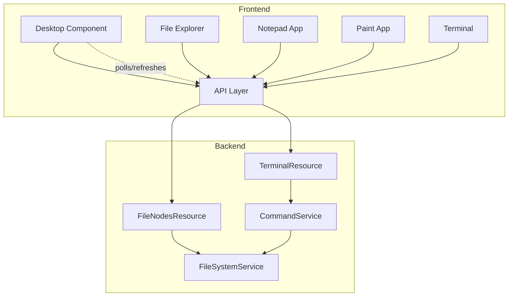

# Design Document: File Persistence

## Overview

This design extends the WebOS Portfolio file system to support content persistence from applications. It enables Notepad to save text files, Paint to save PNG images, and Terminal to create files with content via echo commands. The system maintains real-time synchronization between the file system and desktop icons.

## Architecture



The architecture extends the existing BCE pattern:
- **Boundary**: FileNodesResource (enhanced with PUT for content updates)
- **Control**: FileSystemService (enhanced with updateContent), CommandService (enhanced with echo)
- **Entity**: FileNode (unchanged - content field already supports text and base64)

## Components and Interfaces

### Backend Components

#### FileSystemService (Enhanced)

Add content update capability:

```java
@ApplicationScoped
public class FileSystemService {
    // Existing methods...
    
    /**
     * Updates the content of an existing FileNode.
     * Returns the updated node or empty if not found.
     */
    Optional<FileNode> updateContent(String id, String content) {
        var index = findIndexById(id);
        if (index < 0) return Optional.empty();
        
        var existing = this.mft.get(index);
        var updated = new FileNode(
            existing.id(),
            existing.parentId(),
            existing.name(),
            existing.type(),
            content
        );
        this.mft.set(index, updated);
        return Optional.of(updated);
    }
    
    /**
     * Creates a file with content, or updates if name exists in parent.
     * Returns the created/updated node.
     */
    FileNode saveFile(String parentId, String name, String content) {
        var existing = findByNameInParent(parentId, name);
        if (existing.isPresent()) {
            return updateContent(existing.get().id(), content).orElseThrow();
        }
        return createNode(parentId, name, FileType.FILE, content);
    }
    
    int findIndexById(String id) {
        for (int i = 0; i < this.mft.size(); i++) {
            if (this.mft.get(i).id().equals(id)) return i;
        }
        return -1;
    }
}
```

#### CommandService (Enhanced)

Add echo command support:

```java
@ApplicationScoped
public class CommandService {
    // Existing methods...
    
    /**
     * Handles echo command with redirection.
     * Supports: echo "content" > file (overwrite)
     *           echo "content" >> file (append)
     */
    CommandResult echo(String[] parts) {
        // Parse for > or >> redirection
        var input = String.join(" ", parts).substring(5); // Remove "echo "
        
        if (input.contains(">>")) {
            return handleAppend(input);
        } else if (input.contains(">")) {
            return handleOverwrite(input);
        }
        
        // No redirection - just echo to output
        return new CommandResult(true, extractContent(input), null);
    }
    
    CommandResult handleOverwrite(String input) {
        var parts = input.split(">");
        var content = extractContent(parts[0].trim());
        var filename = parts[1].trim();
        
        fileSystemService.saveFile(currentDirectory, filename, content);
        return new CommandResult(true, "", null);
    }
    
    CommandResult handleAppend(String input) {
        var parts = input.split(">>");
        var content = extractContent(parts[0].trim());
        var filename = parts[1].trim();
        
        var existing = fileSystemService.findByNameInParent(currentDirectory, filename);
        var newContent = existing
            .map(f -> f.content() + "\n" + content)
            .orElse(content);
        
        fileSystemService.saveFile(currentDirectory, filename, newContent);
        return new CommandResult(true, "", null);
    }
    
    String extractContent(String quoted) {
        // Remove surrounding quotes if present
        if (quoted.startsWith("\"") && quoted.endsWith("\"")) {
            return quoted.substring(1, quoted.length() - 1);
        }
        return quoted;
    }
}
```

#### FileNodesResource (Enhanced)

Add PUT endpoint for content updates:

```java
@Path("files")
@Produces(MediaType.APPLICATION_JSON)
@Consumes(MediaType.APPLICATION_JSON)
public class FileNodesResource {
    // Existing endpoints...
    
    @PUT
    @Path("{id}/content")
    public Response updateContent(@PathParam("id") String id, JsonObject body) {
        var content = body.getString("content", "");
        return fileSystemService.updateContent(id, content)
            .map(node -> Response.ok(node.toJSON()).build())
            .orElse(Response.status(Response.Status.NOT_FOUND).build());
    }
    
    @POST
    @Path("save")
    public Response saveFile(JsonObject body) {
        var parentId = body.getString("parentId", "desktop");
        var name = body.getString("name");
        var content = body.getString("content", "");
        
        if (name == null || name.isBlank()) {
            return Response.status(Response.Status.BAD_REQUEST)
                .entity(Json.createObjectBuilder().add("error", "Name required").build())
                .build();
        }
        
        var node = fileSystemService.saveFile(parentId, name, content);
        return Response.status(Response.Status.CREATED)
            .entity(node.toJSON())
            .build();
    }
}
```

### Frontend Components

#### API Extensions

```typescript
// New API functions in api/index.ts

export async function updateFileContent(id: string, content: string): Promise<FileNode> {
  const response = await fetch(`${API_BASE}/files/${id}/content`, {
    method: 'PUT',
    headers: { 'Content-Type': 'application/json' },
    body: JSON.stringify({ content })
  })
  if (!response.ok) throw new Error('Failed to update file')
  return response.json()
}

export async function saveFile(parentId: string, name: string, content: string): Promise<FileNode> {
  const response = await fetch(`${API_BASE}/files/save`, {
    method: 'POST',
    headers: { 'Content-Type': 'application/json' },
    body: JSON.stringify({ parentId, name, content })
  })
  if (!response.ok) throw new Error('Failed to save file')
  return response.json()
}
```

#### Paint Component (Enhanced)

Add save dialog and PNG export:

```typescript
interface PaintProps {
  onClose: () => void
  currentDirectory?: string  // Default: 'desktop'
  onFileSaved?: () => void   // Callback to refresh parent
}

function Paint({ onClose, currentDirectory = 'desktop', onFileSaved }: PaintProps) {
  const [showSaveDialog, setShowSaveDialog] = useState(false)
  const [filename, setFilename] = useState('')
  
  async function handleSave() {
    const canvas = canvasRef.current
    if (!canvas) return
    
    // Export canvas as base64 PNG
    const dataUrl = canvas.toDataURL('image/png')
    const base64Content = dataUrl.split(',')[1]
    
    // Ensure .png extension
    const finalName = filename.endsWith('.png') ? filename : `${filename}.png`
    
    await saveFile(currentDirectory, finalName, base64Content)
    setShowSaveDialog(false)
    onFileSaved?.()
  }
  
  // ... rest of component
}
```

#### Notepad Component (Enhanced)

Add save-as functionality:

```typescript
interface NotepadProps {
  onClose: () => void
  file?: FileNode | null
  currentDirectory?: string  // For new files
  onFileSaved?: () => void
}

function Notepad({ onClose, file, currentDirectory = 'desktop', onFileSaved }: NotepadProps) {
  const [showSaveDialog, setShowSaveDialog] = useState(false)
  const [filename, setFilename] = useState('')
  
  async function handleSave() {
    if (file) {
      // Update existing file
      await updateFileContent(file.id, content)
    } else {
      // Save new file
      const finalName = filename.endsWith('.txt') ? filename : `${filename}.txt`
      await saveFile(currentDirectory, finalName, content)
    }
    setIsDirty(false)
    onFileSaved?.()
  }
  
  // ... rest of component
}
```

#### Desktop Component (Enhanced)

Add refresh capability:

```typescript
function Desktop({ ... }: DesktopProps) {
  // Add refresh function
  const refreshDesktop = useCallback(async () => {
    const nodes = await fetchFileNodes('desktop')
    setIcons(nodes)
    // Preserve existing positions, add defaults for new icons
    const containerHeight = window.innerHeight
    setIconPositions(prev => {
      const updated = { ...prev }
      nodes.forEach((node, index) => {
        if (!updated[node.id]) {
          updated[node.id] = getDefaultPosition(index, containerHeight)
        }
      })
      return updated
    })
  }, [])
  
  // Pass refresh to child apps
  // ...
}
```

## Data Models

### FileNode (Unchanged)

The existing FileNode record already supports content storage:

```java
public record FileNode(
    String id,
    String parentId,
    String name,
    FileType type,
    String content  // Supports text or base64-encoded binary
)
```

### Save Request

```typescript
interface SaveFileRequest {
  parentId: string
  name: string
  content: string  // Text or base64 for binary
}
```

## Correctness Properties

*A property is a characteristic or behavior that should hold true across all valid executions of a system—essentially, a formal statement about what the system should do. Properties serve as the bridge between human-readable specifications and machine-verifiable correctness guarantees.*

### Property 1: File Content Update Round-Trip

*For any* existing FileNode of type FILE and any valid content string, updating the content and then reading the file SHALL return the exact content that was saved.

**Validates: Requirements 1.1, 4.1, 6.1**

### Property 2: File Creation with Content

*For any* valid parent directory, filename, and content string, creating a file SHALL result in a FileNode that can be retrieved with the exact content provided.

**Validates: Requirements 1.2, 4.3, 6.2**

### Property 3: Base64 Content Preservation

*For any* valid base64-encoded string, saving it as file content and retrieving it SHALL return the identical base64 string.

**Validates: Requirements 1.3, 6.5**

### Property 4: Save Preserves Single File

*For any* existing file in a directory, saving with the same name SHALL update that file's content without creating a duplicate, and the directory SHALL contain exactly one file with that name.

**Validates: Requirements 1.4**

### Property 5: Node Creation Visibility

*For any* FileNode created in a directory, querying that directory's contents SHALL include the newly created node.

**Validates: Requirements 2.1, 2.3, 2.5**

### Property 6: Node Deletion Visibility

*For any* FileNode deleted from a directory, querying that directory's contents SHALL NOT include the deleted node.

**Validates: Requirements 2.2**

### Property 7: Echo Command File Operations

*For any* content string and filename, executing `echo "content" > filename` SHALL create a file containing exactly that content, and executing `echo "more" >> filename` SHALL append to the existing content with a newline separator.

**Validates: Requirements 5.1, 5.2**

## Error Handling

### Backend Errors

| Operation | Error Condition | Response |
|-----------|----------------|----------|
| updateContent | File not found | 404 Not Found |
| saveFile | Name is blank | 400 Bad Request |
| saveFile | Parent not found | 404 Not Found |
| echo > | Invalid syntax | Error message in CommandResult |

### Frontend Error Handling

- Network errors display toast notification
- Save failures show error dialog with retry option
- Invalid filenames show validation message

## Testing Strategy

### Unit Tests

Unit tests verify specific examples and edge cases:
- Echo command parsing with various quote styles
- Filename extension normalization
- Error conditions (missing file, invalid name)

### Property-Based Tests

Property-based tests use jqwik to verify universal properties:
- Each property from the Correctness Properties section gets a dedicated PBT
- Minimum 100 iterations per property test
- Tests generate random valid content strings and filenames
- Tag format: **Feature: file-persistence, Property N: <property_text>**

### Testing Framework

- **Backend**: JUnit 5 + jqwik for property-based testing
- **Frontend**: Vitest for unit tests

### Test Organization

```
src/test/java/io/webos/portfolio/
├── filesystem/
│   └── control/
│       └── FileSystemPersistenceProperties.java  # Property tests
└── terminal/
    └── control/
        └── EchoCommandProperties.java            # Property tests
```
