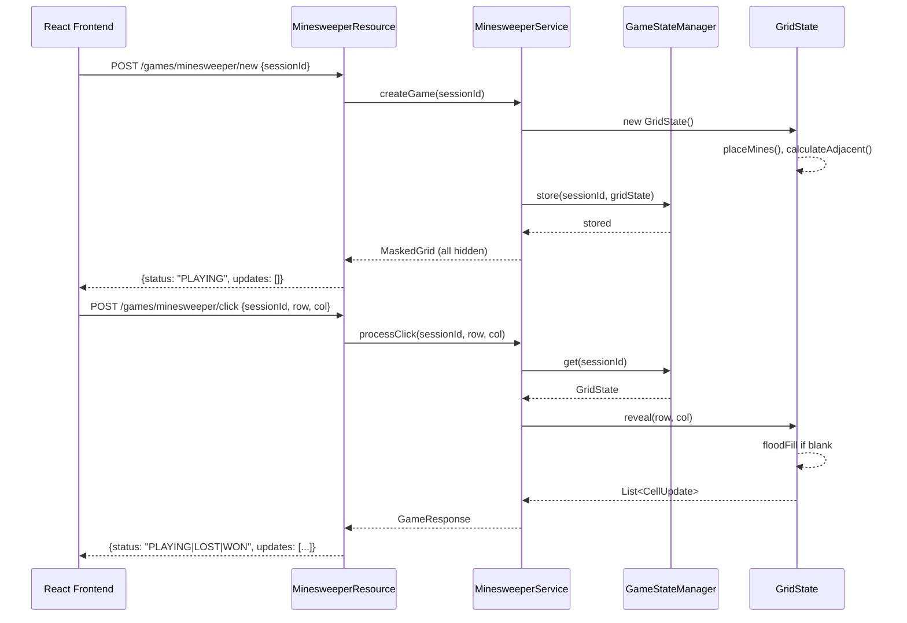

# Design Document: Minesweeper Game

## Overview

This design implements a server-authoritative Minesweeper game for the WebOS Portfolio. The architecture ensures game integrity by keeping all mine positions and game logic on the server, exposing only revealed cell information to the client. The backend follows the BCE (Boundary-Control-Entity) pattern consistent with the existing codebase.

## Architecture



## Components and Interfaces

### Backend Package Structure

```
io.webos.portfolio.games.minesweeper/
├── boundary/
│   └── MinesweeperResource.java    # JAX-RS REST endpoints
├── control/
│   ├── MinesweeperService.java     # Game logic orchestration
│   └── GameStateManager.java       # Session state storage
└── entity/
    ├── GridState.java              # Game board state and logic
    ├── CellUpdate.java             # Single cell reveal data
    ├── GameResponse.java           # API response structure
    └── GameStatus.java             # PLAYING, LOST, WON enum
```

### Entity Layer

#### GameStatus.java
```java
public enum GameStatus {
    PLAYING,
    LOST,
    WON
}
```

#### CellUpdate.java
```java
public record CellUpdate(int r, int c, int val) {
    public JsonObject toJSON() {
        return Json.createObjectBuilder()
            .add("r", this.r)
            .add("c", this.c)
            .add("val", this.val)
            .build();
    }
}
```

#### GameResponse.java
```java
public record GameResponse(GameStatus status, List<CellUpdate> updates) {
    public JsonObject toJSON() {
        var updatesArray = Json.createArrayBuilder();
        this.updates.forEach(u -> updatesArray.add(u.toJSON()));
        return Json.createObjectBuilder()
            .add("status", this.status.name())
            .add("updates", updatesArray)
            .build();
    }
}
```

#### GridState.java
Core game state holding:
- `int[][] grid` - Internal 10x10 grid (9=mine, 0-8=adjacent count)
- `boolean[][] revealed` - Tracks which cells are visible
- `GameStatus status` - Current game state
- `int revealedCount` - Count of revealed non-mine cells
- `int mineCount` - Total mines (10)

### Control Layer

#### GameStateManager.java
Singleton managing active sessions:
```java
@ApplicationScoped
public class GameStateManager {
    ConcurrentHashMap<String, GridState> sessions = new ConcurrentHashMap<>();
    
    GridState createOrReplace(String sessionId) { ... }
    Optional<GridState> get(String sessionId) { ... }
    void remove(String sessionId) { ... }
}
```

#### MinesweeperService.java
Game logic coordinator:
```java
@ApplicationScoped
public class MinesweeperService {
    @Inject GameStateManager stateManager;
    
    GameResponse newGame(String sessionId) { ... }
    GameResponse click(String sessionId, int row, int col) { ... }
}
```

### Boundary Layer

#### MinesweeperResource.java
```java
@Path("/games/minesweeper")
@Produces(MediaType.APPLICATION_JSON)
@Consumes(MediaType.APPLICATION_JSON)
public class MinesweeperResource {
    
    @POST @Path("/new")
    Response newGame(JsonObject request) { ... }
    
    @POST @Path("/click")
    Response click(JsonObject request) { ... }
}
```

### Frontend Components

#### Minesweeper.tsx
Main game component with:
- Session ID generation and localStorage persistence
- 10x10 grid rendering with cell state management
- Click handlers calling backend API
- Visual feedback for numbers, mines, and flags
- Game status display (playing/won/lost)

#### API Functions (api/index.ts additions)
```typescript
interface CellUpdate { r: number; c: number; val: number }
interface GameResponse { status: 'PLAYING' | 'LOST' | 'WON'; updates: CellUpdate[] }

async function newMinesweeperGame(sessionId: string): Promise<GameResponse>
async function clickMinesweeperCell(sessionId: string, row: number, col: number): Promise<GameResponse>
```

## Data Models

### Internal Grid Representation
```
Cell Values:
- 0-8: Number of adjacent mines
- 9: Mine cell

Example 10x10 grid (partial):
[1, 1, 1, 0, 0, 0, 1, 9, 1, 0]
[9, 2, 1, 0, 0, 0, 1, 1, 1, 0]
[1, 2, 9, 1, 0, 0, 0, 0, 0, 0]
...
```

### API Request/Response Formats

#### POST /games/minesweeper/new
Request:
```json
{ "sessionId": "uuid-string" }
```
Response:
```json
{ "status": "PLAYING", "updates": [] }
```

#### POST /games/minesweeper/click
Request:
```json
{ "sessionId": "uuid-string", "row": 2, "col": 3 }
```
Response (number revealed):
```json
{ "status": "PLAYING", "updates": [{"r": 2, "c": 3, "val": 2}] }
```
Response (blank with flood fill):
```json
{ 
  "status": "PLAYING", 
  "updates": [
    {"r": 2, "c": 3, "val": 0},
    {"r": 2, "c": 4, "val": 0},
    {"r": 1, "c": 3, "val": 1},
    {"r": 3, "c": 3, "val": 1}
  ] 
}
```
Response (mine hit):
```json
{ "status": "LOST", "updates": [{"r": 2, "c": 3, "val": 9}] }
```

### Frontend Cell State
```typescript
interface CellState {
  revealed: boolean
  value: number      // -1 = unknown, 0-8 = number, 9 = mine
  flagged: boolean   // Client-side only
}
```


## Correctness Properties

*A property is a characteristic or behavior that should hold true across all valid executions of a system—essentially, a formal statement about what the system should do. Properties serve as the bridge between human-readable specifications and machine-verifiable correctness guarantees.*

### Property 1: New Game Initialization

*For any* valid session ID, creating a new game SHALL store a GridState in the GameStateManager AND return a response with status "PLAYING" and an empty updates array.

**Validates: Requirements 1.1, 1.2**

### Property 2: Session Replacement Idempotence

*For any* existing session ID, calling newGame again SHALL replace the existing GridState with a fresh game, such that subsequent clicks behave as if no previous game existed.

**Validates: Requirements 1.3**

### Property 3: Grid Validity Invariant

*For any* generated GridState:
- The grid dimensions SHALL be exactly 10x10
- The grid SHALL contain exactly 10 cells with value 9 (mines)
- Each non-mine cell's value SHALL equal the count of adjacent cells containing mines (0-8)

**Validates: Requirements 2.1, 2.2, 2.3**

### Property 4: Mine Click Terminates Game

*For any* game in PLAYING status, clicking a cell containing a mine SHALL:
- Set game status to LOST
- Return updates containing exactly one cell (the clicked mine) with value 9

**Validates: Requirements 3.2**

### Property 5: Number Click Reveals Single Cell

*For any* game in PLAYING status, clicking an unrevealed cell with value 1-8 SHALL return updates containing exactly that one cell with its correct value.

**Validates: Requirements 3.3**

### Property 6: Flood Fill Correctness

*For any* game in PLAYING status, clicking an unrevealed blank cell (value 0) SHALL reveal:
- The clicked cell
- All connected blank cells (reachable through adjacent blank cells)
- All numbered cells (1-8) that border the revealed blank region

**Validates: Requirements 3.4**

### Property 7: Security - No Hidden Information Leaked

*For any* API response:
- The updates array SHALL only contain cells that have been revealed
- No unrevealed mine positions SHALL be exposed
- When status is LOST, only the clicked mine SHALL be revealed, not all mines

**Validates: Requirements 4.1, 4.2, 4.4**

### Property 8: Win Condition Detection

*For any* game where all 90 non-mine cells have been revealed, the game status SHALL be WON.

**Validates: Requirements 5.1**

### Property 9: Frontend Cell Update Consistency

*For any* click response received by the frontend, only the cells specified in the updates array SHALL have their visual state changed.

**Validates: Requirements 6.3**

### Property 10: Flag Toggle Behavior

*For any* unrevealed cell on the frontend:
- Right-clicking SHALL toggle the flagged state
- Left-clicking a flagged cell SHALL NOT trigger a reveal request

**Validates: Requirements 7.1, 7.2**

## Error Handling

### Backend Errors

| Error Condition | Response |
|----------------|----------|
| Missing sessionId in request | 400 Bad Request with error message |
| Invalid sessionId (not found) | 404 Not Found with error message |
| Invalid row/col (out of bounds) | 400 Bad Request with error message |
| Click on already revealed cell | 200 OK with empty updates (no-op) |
| Click after game ended | 200 OK with current status, empty updates |

### Frontend Error Handling

- Network errors: Display toast notification, allow retry
- Invalid responses: Log error, maintain current state
- Session expiry: Generate new session ID, start fresh game

## Testing Strategy

### Property-Based Testing (Backend)

Use **jqwik** for property-based testing in Java. Each property test runs minimum 100 iterations.

```java
// Example property test structure
@Property(tries = 100)
void gridValidityInvariant(@ForAll("validGridState") GridState grid) {
    // Feature: minesweeper-game, Property 3: Grid Validity Invariant
    assertThat(grid.width()).isEqualTo(10);
    assertThat(grid.height()).isEqualTo(10);
    assertThat(grid.countMines()).isEqualTo(10);
    // Verify adjacent counts...
}
```

### Unit Tests (Backend)

- GridState initialization edge cases
- Flood fill boundary conditions
- Win condition edge case (last cell revealed)
- Error response formatting

### Frontend Testing

- Component rendering tests (React Testing Library)
- Click handler integration tests
- Flag toggle state management
- Game over state transitions

### Test Coverage Matrix

| Property | Test Type | Component |
|----------|-----------|-----------|
| 1 | Property | MinesweeperService |
| 2 | Property | GameStateManager |
| 3 | Property | GridState |
| 4 | Property | GridState.reveal() |
| 5 | Property | GridState.reveal() |
| 6 | Property | GridState.floodFill() |
| 7 | Property | MinesweeperResource |
| 8 | Property | GridState |
| 9 | Unit | Minesweeper.tsx |
| 10 | Unit | Minesweeper.tsx |
