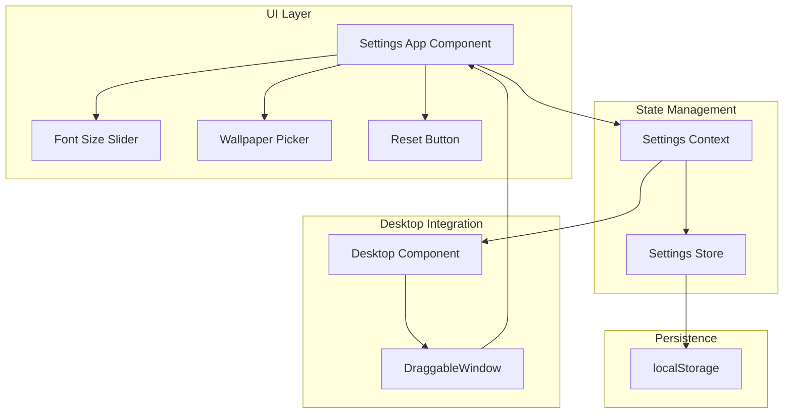

# Design Document: Settings App

## Overview

The Settings app is a React component that provides a windowed interface for users to customize their WebOS experience. It follows the existing app pattern established by TaskManager and Terminal, integrating with the Desktop component through the standard app lifecycle. Settings are persisted to localStorage and applied globally through a React context provider.

## Architecture



## Components and Interfaces

### Settings Component

The main Settings app component renders within a DraggableWindow and provides the UI for all settings options.

```typescript
interface SettingsProps {
  onClose: () => void
}

function Settings({ onClose }: SettingsProps): JSX.Element
```

### Settings Context

A React context that provides settings state and update functions to all components.

```typescript
interface SettingsState {
  fontSize: number
  wallpaperUrl: string
}

interface SettingsContextValue {
  settings: SettingsState
  updateFontSize: (size: number) => void
  updateWallpaper: (url: string) => void
  resetToDefaults: () => void
}

const SettingsContext = createContext<SettingsContextValue | null>(null)
```

### Settings Store Functions

Pure functions for settings persistence and validation.

```typescript
interface SettingsStore {
  load(): SettingsState
  save(settings: SettingsState): void
  getDefaults(): SettingsState
}

function isValidFontSize(size: number): boolean
function isValidUrl(url: string): boolean
```

### Font Size Slider Component

```typescript
interface FontSizeSliderProps {
  value: number
  onChange: (size: number) => void
}

function FontSizeSlider({ value, onChange }: FontSizeSliderProps): JSX.Element
```

### Wallpaper Picker Component

```typescript
interface WallpaperPickerProps {
  currentUrl: string
  onSelect: (url: string) => void
}

function WallpaperPicker({ currentUrl, onSelect }: WallpaperPickerProps): JSX.Element
```

## Data Models

### Settings State

```typescript
interface SettingsState {
  fontSize: number      // Range: 12-24, step: 2
  wallpaperUrl: string  // Valid URL string
}
```

### Default Settings

```typescript
const DEFAULT_SETTINGS: SettingsState = {
  fontSize: 14,
  wallpaperUrl: 'https://images.unsplash.com/photo-1579546929518-9e396f3cc809?w=1920&q=80'
}
```

### Preset Wallpapers

```typescript
const PRESET_WALLPAPERS: string[] = [
  'https://images.unsplash.com/photo-1579546929518-9e396f3cc809?w=1920&q=80',
  'https://images.unsplash.com/photo-1557683316-973673baf926?w=1920&q=80',
  'https://images.unsplash.com/photo-1518837695005-2083093ee35b?w=1920&q=80',
  'https://images.unsplash.com/photo-1507400492013-162706c8c05e?w=1920&q=80'
]
```

### localStorage Key

```typescript
const SETTINGS_STORAGE_KEY = 'webos-settings'
```


## Correctness Properties

*A property is a characteristic or behavior that should hold true across all valid executions of a system—essentially, a formal statement about what the system should do. Properties serve as the bridge between human-readable specifications and machine-verifiable correctness guarantees.*

### Property 1: Settings Persistence Round-Trip

*For any* valid SettingsState object, saving it to the Settings_Store and then loading it back SHALL produce an equivalent SettingsState object.

This is a round-trip property that validates the serialization/deserialization cycle through localStorage. It ensures that no data is lost or corrupted during persistence.

**Validates: Requirements 2.2, 3.3, 4.1, 4.2, 4.4**

### Property 2: Font Size Validation

*For any* number, the font size validator SHALL return true if and only if the number is between 12 and 24 (inclusive) and is divisible by 2.

This property ensures the validation logic correctly accepts valid font sizes (12, 14, 16, 18, 20, 22, 24) and rejects all other values.

**Validates: Requirements 2.4, 2.5**

### Property 3: URL Validation

*For any* string, the URL validator SHALL return true if and only if the string is a valid URL with http or https protocol.

This property ensures custom wallpaper URLs are properly validated before being accepted.

**Validates: Requirements 3.5**

### Property 4: App Opening Idempotence

*For any* state where the Settings app is already in the openApps list, attempting to open the Settings app again SHALL not increase the length of the openApps list.

This is an idempotence property ensuring duplicate windows are not created.

**Validates: Requirements 1.3**

### Property 5: Reset Restores Defaults

*For any* SettingsState, after calling resetToDefaults(), the resulting settings SHALL equal the DEFAULT_SETTINGS constant.

This property ensures the reset functionality always produces the expected default state regardless of the current settings.

**Validates: Requirements 5.2**

### Property 6: Settings Display Reflects State

*For any* valid SettingsState provided to the Settings component, the rendered output SHALL display the fontSize and wallpaperUrl values from that state.

This property ensures the UI accurately reflects the underlying state.

**Validates: Requirements 1.2**

## Error Handling

### Invalid Font Size
- When an invalid font size is provided, the `isValidFontSize` function returns false
- The Settings component prevents invalid values from being applied
- The current valid font size is maintained

### Invalid URL
- When an invalid URL is provided, the `isValidUrl` function returns false
- The Settings component displays an error message
- The current wallpaper URL is maintained

### Wallpaper Load Failure
- When a wallpaper image fails to load, an onError handler catches the failure
- An error message is displayed to the user
- The previous wallpaper is maintained

### localStorage Unavailable
- When localStorage is unavailable, settings operations fail gracefully
- Default settings are used as fallback
- No error is thrown to crash the application

### Corrupted Storage Data
- When localStorage contains invalid JSON, the load function catches the parse error
- Default settings are returned
- The corrupted data is overwritten on next save

## Testing Strategy

### Unit Tests

Unit tests verify specific examples and edge cases:

1. **Settings Store Tests**
   - Load returns defaults when localStorage is empty
   - Load returns defaults when localStorage contains invalid JSON
   - Save correctly serializes settings to localStorage
   - getDefaults returns the expected default values

2. **Validation Tests**
   - isValidFontSize accepts boundary values (12, 24)
   - isValidFontSize rejects values outside range (10, 26)
   - isValidFontSize rejects non-step values (13, 15)
   - isValidUrl accepts valid http/https URLs
   - isValidUrl rejects invalid strings

3. **Component Tests**
   - Settings component renders with provided values
   - Font size slider updates on change
   - Wallpaper picker displays preset options
   - Close button triggers onClose callback
   - Reset button shows confirmation dialog

### Property-Based Tests

Property-based tests use fast-check to verify universal properties across many generated inputs. Each test runs minimum 100 iterations.

1. **Settings Persistence Round-Trip**
   - Generate random valid SettingsState objects
   - Save to mock localStorage, then load
   - Assert loaded state equals original state
   - **Feature: settings-app, Property 1: Settings persistence round-trip**

2. **Font Size Validation**
   - Generate random integers
   - Assert isValidFontSize returns true iff value is in {12, 14, 16, 18, 20, 22, 24}
   - **Feature: settings-app, Property 2: Font size validation**

3. **URL Validation**
   - Generate random strings and valid URLs
   - Assert isValidUrl correctly classifies each input
   - **Feature: settings-app, Property 3: URL validation**

4. **App Opening Idempotence**
   - Generate random openApps arrays containing settings app
   - Simulate opening settings app
   - Assert array length unchanged
   - **Feature: settings-app, Property 4: App opening idempotence**

5. **Reset Restores Defaults**
   - Generate random SettingsState objects
   - Call resetToDefaults
   - Assert result equals DEFAULT_SETTINGS
   - **Feature: settings-app, Property 5: Reset restores defaults**

### Testing Framework

- **Unit Tests**: Vitest with React Testing Library
- **Property Tests**: fast-check integrated with Vitest
- **Minimum iterations**: 100 per property test
