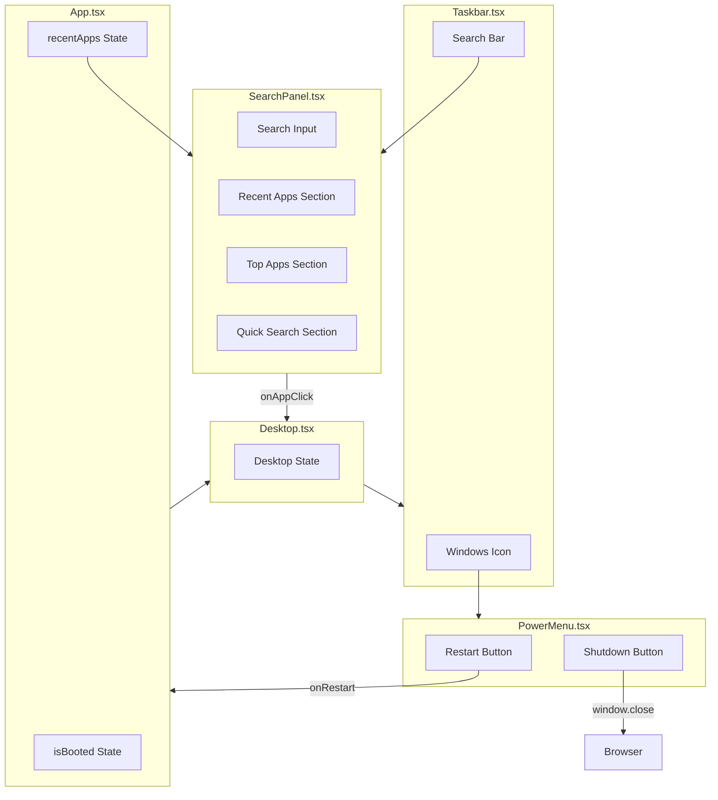

# Design Document: Taskbar Features

## Overview

This design extends the WebOS Portfolio taskbar with two key features: a Windows icon power menu and an expandable search panel. The power menu provides restart and shutdown functionality, while the search panel offers quick access to recent apps, top apps, and quick search shortcuts.

The implementation follows React functional component patterns with TypeScript, using Tailwind CSS for styling. State management is handled through React hooks and prop drilling from the App component to enable restart functionality.

## Architecture



## Components and Interfaces

### Component: PowerMenu

A popup menu displayed when clicking the Windows icon, containing restart and shutdown options.

```typescript
interface PowerMenuProps {
  isOpen: boolean
  onClose: () => void
  onRestart: () => void
  onShutdown: () => void
}

function PowerMenu({ isOpen, onClose, onRestart, onShutdown }: PowerMenuProps)
```

**Behavior:**
- Renders above the Windows icon when `isOpen` is true
- Displays "Restart" and "Shutdown" options with icons
- Closes when clicking outside via backdrop overlay
- Restart triggers `onRestart` callback to reset boot state
- Shutdown calls `window.close()` to close the browser tab

### Component: SearchPanel

An expandable search interface showing recent apps, top apps, and quick search options.

```typescript
interface SearchPanelProps {
  isOpen: boolean
  onClose: () => void
  recentApps: RecentApp[]
  onAppClick: (appId: string) => void
  searchQuery: string
  onSearchChange: (query: string) => void
}

interface RecentApp {
  id: string
  name: string
  icon: string
  timestamp: number
}

function SearchPanel({ isOpen, onClose, recentApps, onAppClick, searchQuery, onSearchChange }: SearchPanelProps)
```

**Layout Structure:**
```
┌─────────────────────────────────────────────────────────┐
│  [Search Input]                                    A ⋯  │
├──────────────────────┬──────────────────────────────────┤
│  Recent              │  Quick searches                  │
│  ┌────┐              │  [Focus settings] [Sound...]     │
│  │ 🔵 │ Kiro         │  [Bluetooth...] [Display...]     │
│  └────┘              │  [Color settings] [Search...]    │
│  ┌────┐              │                                  │
│  │ 💬 │ Discord      │  Top apps                        │
│  └────┘              │  ┌─────┐ ┌─────┐ ┌─────┐        │
│  ┌────┐              │  │ 🎮  │ │ 🎯  │ │ ✂️  │        │
│  │ 🦈 │ Wireshark    │  │Game │ │LoL  │ │Snip │        │
│  └────┘              │  └─────┘ └─────┘ └─────┘        │
│                      │  ┌─────┐ ┌─────┐ ┌─────┐        │
│                      │  │ 📁  │ │ 🌐  │ │ 💻  │        │
│                      │  │File │ │Chrome│ │Term │        │
│                      │  └─────┘ └─────┘ └─────┘        │
└──────────────────────┴──────────────────────────────────┘
```

### Updated Component: Taskbar

Extended to handle power menu and search panel state.

```typescript
interface TaskbarProps {
  onStartClick: () => void
  isStartMenuOpen: boolean
  openApps: OpenApp[]
  onReorderApps: (apps: OpenApp[]) => void
  onAppClick: (appId: string) => void
  onRestart: () => void
  recentApps: RecentApp[]
}
```

### Updated Component: App

Extended to manage boot state reset for restart functionality.

```typescript
function App() {
  const [isBooted, setIsBooted] = useState(false)
  const [recentApps, setRecentApps] = useState<RecentApp[]>([])

  function handleRestart() {
    setRecentApps([])  // Clear recent apps
    setIsBooted(false) // Trigger BIOS sequence
  }

  function handleShutdown() {
    window.close()
  }
  
  // ... rest of component
}
```

## Data Models

### RecentApp Type

```typescript
interface RecentApp {
  id: string        // Unique identifier for the app
  name: string      // Display name
  icon: string      // Emoji or icon identifier
  timestamp: number // When the app was last opened (for ordering)
}
```

### TopApp Configuration

```typescript
const TOP_APPS: TopApp[] = [
  { id: 'game-bar', name: 'Game Bar', icon: '🎮' },
  { id: 'league', name: 'League of Legends', icon: '🎯' },
  { id: 'snipping-tool', name: 'Snipping Tool', icon: '✂️' },
  { id: 'file-explorer', name: 'File Explorer', icon: '📁' },
  { id: 'chrome', name: 'Google Chrome', icon: '🌐' },
  { id: 'terminal', name: 'Terminal', icon: '💻' },
]
```

### QuickSearch Configuration

```typescript
const QUICK_SEARCHES = [
  'Focus settings',
  'Sound settings',
  'Bluetooth & devices',
  'Display settings',
  'Color settings',
  'Search settings',
]
```

## Correctness Properties

*A property is a characteristic or behavior that should hold true across all valid executions of a system—essentially, a formal statement about what the system should do. Properties serve as the bridge between human-readable specifications and machine-verifiable correctness guarantees.*

### Property 1: Menu Toggle Consistency

*For any* click on the Windows icon or search bar, the corresponding menu/panel visibility state SHALL toggle from its current value (open→closed or closed→open).

**Validates: Requirements 1.1, 2.1**

### Property 2: Click-Outside Closes Menus

*For any* open menu or panel (Power_Menu or Search_Panel), clicking outside the component SHALL result in the menu/panel being closed.

**Validates: Requirements 1.2, 2.2**

### Property 3: Restart Resets Boot State

*For any* restart action triggered, the application boot state SHALL be reset to false, causing the BIOS sequence to replay.

**Validates: Requirements 1.5**

### Property 4: Search Filtering Accuracy

*For any* search query string, the filtered apps list SHALL contain only apps whose names include the query string (case-insensitive).

**Validates: Requirements 2.4**

### Property 5: Recent Apps List Size Constraint

*For any* list of recent apps, the displayed count SHALL be at most 5, showing the most recently opened apps.

**Validates: Requirements 3.2**

### Property 6: Recent Apps Reset on Restart

*For any* restart action, the recent apps list SHALL be cleared to an empty array.

**Validates: Requirements 3.5**

### Property 7: App Click Triggers Callback

*For any* app click in the Recent Apps or Top Apps sections, the onAppClick callback SHALL be invoked with the correct app identifier.

**Validates: Requirements 3.4, 4.4**

### Property 8: Grid Items Display Required Elements

*For any* app displayed in the Top Apps grid or Quick Search section, the rendered output SHALL contain both the app's icon and name.

**Validates: Requirements 4.3, 5.3**

## Error Handling

### Browser Tab Close Restriction

Modern browsers restrict `window.close()` to tabs opened via JavaScript. If the tab cannot be closed:
- Display a toast notification: "Please close this tab manually"
- Log the restriction for debugging

### Empty Recent Apps

When no apps have been opened:
- Display placeholder text: "No recent apps"
- Maintain section visibility for consistent layout

### Search No Results

When search query matches no apps:
- Display message: "No apps found"
- Suggest clearing the search

## Testing Strategy

### Dual Testing Approach

This feature uses both unit tests and property-based tests:

- **Unit tests**: Verify specific UI states, edge cases, and component rendering
- **Property tests**: Verify universal behaviors across randomly generated inputs

### Property-Based Testing Configuration

- **Library**: fast-check (JavaScript/TypeScript property-based testing)
- **Minimum iterations**: 100 per property test
- **Tag format**: `// Feature: taskbar-features, Property N: {property_text}`

### Unit Tests

| Test | Description | Requirements |
|------|-------------|--------------|
| PowerMenu renders restart option | Verify restart button is present | 1.3 |
| PowerMenu renders shutdown option | Verify shutdown button is present | 1.4 |
| SearchPanel renders search input | Verify search input is present | 2.3 |
| SearchPanel renders Recent section | Verify Recent section header | 3.1 |
| SearchPanel renders Top apps grid | Verify 6 apps in grid | 4.1, 4.2 |
| SearchPanel renders Quick searches | Verify all 6 quick search items | 5.1, 5.2 |
| Empty recent apps shows placeholder | Verify placeholder message | 3.3 |

### Property Tests

| Property | Test Description | Iterations |
|----------|-----------------|------------|
| Property 1 | Toggle state changes on click | 100 |
| Property 2 | Click outside closes open menus | 100 |
| Property 3 | Restart sets isBooted to false | 100 |
| Property 4 | Search filters apps correctly | 100 |
| Property 5 | Recent apps limited to 5 | 100 |
| Property 6 | Restart clears recent apps | 100 |
| Property 7 | App click invokes callback with ID | 100 |
| Property 8 | Grid items have icon and name | 100 |

### Test File Structure

```
webos-ui/src/components/desktop/
├── PowerMenu.tsx
├── PowerMenu.test.tsx
├── SearchPanel.tsx
├── SearchPanel.test.tsx
├── Taskbar.tsx
└── Taskbar.test.tsx
```
