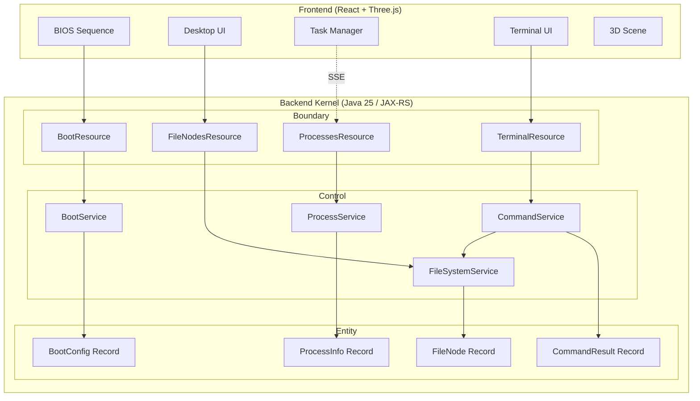

# Design Document: WebOS Portfolio

## Overview

WebOS Portfolio is a browser-based Windows 11 simulation powered by a Java 25 backend "Kernel". The architecture follows a clean separation between the backend (providing OS services) and the frontend (rendering the desktop experience).

The backend implements four core subsystems:
1. **Bootloader** - Stateless configuration provider
2. **Virtual File System (VFS)** - In-memory file structure simulation
3. **Process Manager** - Real-time JVM metrics via SSE
4. **Terminal** - Command-line interface with pattern-matched parsing

The frontend delivers a Windows 11-style UI with optional 3D rendering for desktop devices.

## Architecture



## Components and Interfaces

### Backend Package Structure (BCE Pattern)

```
io.webos.portfolio
├── boot
│   ├── boundary
│   │   └── BootResource.java
│   ├── control
│   │   └── BootService.java
│   └── entity
│       └── BootConfig.java
├── filesystem
│   ├── boundary
│   │   └── FileNodesResource.java
│   ├── control
│   │   └── FileSystemService.java
│   └── entity
│       ├── FileNode.java
│       └── FileType.java
├── processes
│   ├── boundary
│   │   └── ProcessesResource.java
│   ├── control
│   │   └── ProcessService.java
│   └── entity
│       └── ProcessInfo.java
└── terminal
    ├── boundary
    │   └── TerminalResource.java
    ├── control
    │   └── CommandService.java
    └── entity
        └── CommandResult.java
```

### Component: Bootloader

**BootResource** (Boundary)
```java
@Path("/system/boot")
@Produces(MediaType.APPLICATION_JSON)
public class BootResource {
    @GET
    Response boot();
}
```

**BootService** (Control)
- Reads configuration from `microprofile-config.properties`
- Returns default values when properties are missing
- Treats all users as "Visitor"

**BootConfig** (Entity)
```java
public record BootConfig(
    String osVersion,
    String theme,
    String wallpaperUrl,
    String username
) {
    public JsonObject toJSON() { /* JSON-P serialization */ }
    public static BootConfig fromJSON(JsonObject json) { /* deserialization */ }
}
```

### Component: Virtual File System

**FileNodesResource** (Boundary)
```java
@Path("/file-nodes")
@Produces(MediaType.APPLICATION_JSON)
public class FileNodesResource {
    @GET
    Response listNodes(@QueryParam("parentId") @DefaultValue("desktop") String parentId);
}
```

**FileSystemService** (Control)
- Maintains in-memory Master File Table (MFT) using `List.of()`
- Provides file lookup by parentId
- Pre-populated with portfolio content (Resume, GitHub, About Me)

**FileNode** (Entity)
```java
public record FileNode(
    String id,
    String parentId,
    String name,
    FileType type,
    String content
) {
    public JsonObject toJSON() { /* JSON-P serialization */ }
    public static FileNode fromJSON(JsonObject json) { /* deserialization */ }
}

public enum FileType { DIRECTORY, FILE, SHORTCUT }
```

### Component: Process Manager (Real-Time)

**ProcessesResource** (Boundary)
```java
@Path("/processes")
public class ProcessesResource {
    @GET
    @Produces(MediaType.SERVER_SENT_EVENTS)
    void streamProcesses(@Context SseEventSink eventSink, @Context Sse sse);
}
```

**ProcessService** (Control)
- Collects real JVM metrics via `ManagementFactory.getMemoryMXBean()`
- Generates simulated process entries
- Pushes updates at configurable intervals (default: 1 second)

**ProcessInfo** (Entity)
```java
public record ProcessInfo(
    String pid,
    String name,
    long memoryBytes,
    String status
) {
    public JsonObject toJSON() { /* JSON-P serialization */ }
    public static ProcessInfo fromJSON(JsonObject json) { /* deserialization */ }
}
```

### Component: Terminal

**TerminalResource** (Boundary)
```java
@Path("/terminal")
@Consumes(MediaType.APPLICATION_JSON)
@Produces(MediaType.APPLICATION_JSON)
public class TerminalResource {
    @POST
    @Path("/exec")
    Response execute(JsonObject request);
}
```

**CommandService** (Control)
- Parses commands using Java 25 Pattern Matching for switch
- Delegates file operations to FileSystemService
- Supports: `ls`, `cat`, `uname`, `whoami`, `java --version`

```java
// Pattern Matching example
String execute(String input) {
    var parts = input.split("\\s+");
    var command = parts[0];
    
    return switch (command) {
        case "ls" -> listDirectory(parts);
        case "cat" -> catFile(parts);
        case "uname" -> systemInfo();
        case "whoami" -> currentUser();
        case "java" -> javaVersion(parts);
        default -> "Unknown command: " + command;
    };
}
```

**CommandResult** (Entity)
```java
public record CommandResult(
    boolean success,
    String output,
    String error
) {
    public JsonObject toJSON() { /* JSON-P serialization */ }
    public static CommandResult fromJSON(JsonObject json) { /* deserialization */ }
}
```

### Frontend Components

**BIOS Sequence**
- Text-based boot animation component
- Simulates hardware checks (RAM, CPU detection)
- Transitions to Desktop after completion

**Desktop UI**
- Windows 11-style shell (taskbar, start menu, icons)
- Fetches desktop icons from VFS on mount
- Handles icon clicks for navigation/file opening

**Task Manager**
- Connects to SSE endpoint on mount
- Displays real-time process list with memory usage
- Updates UI on each SSE event

**Terminal UI**
- Command input with history support
- Sends commands to `POST /terminal/exec`
- Displays output in monospace font

**3D Scene (Desktop Only)**
- Three.js scene with virtual desk and monitor
- Renders Desktop UI as texture on monitor screen
- Camera controls for scene navigation
- Disabled on mobile (full-screen UI instead)

## Data Models

### Master File Table (MFT) - Initial Data

```java
List<FileNode> MFT = List.of(
    new FileNode("desktop", null, "Desktop", DIRECTORY, null),
    new FileNode("resume", "desktop", "Resume.pdf", FILE, "..."),
    new FileNode("github", "desktop", "GitHub", SHORTCUT, "https://github.com/..."),
    new FileNode("about", "desktop", "About Me.txt", FILE, "..."),
    new FileNode("projects", "desktop", "Projects", DIRECTORY, null),
    new FileNode("terminal", "desktop", "Terminal", SHORTCUT, "app:terminal"),
    new FileNode("task-manager", "desktop", "Task Manager", SHORTCUT, "app:taskmanager")
);
```

### Configuration Properties

```properties
# microprofile-config.properties
webos.version=1.0.0
webos.theme=dark
webos.wallpaper.url=/assets/wallpaper.jpg
webos.user.name=Visitor
webos.process.update.interval=1000
```

### API Response Examples

**GET /system/boot**
```json
{
    "osVersion": "1.0.0",
    "theme": "dark",
    "wallpaperUrl": "/assets/wallpaper.jpg",
    "username": "Visitor"
}
```

**GET /file-nodes?parentId=desktop**
```json
[
    {"id": "resume", "parentId": "desktop", "name": "Resume.pdf", "type": "FILE", "content": "..."},
    {"id": "github", "parentId": "desktop", "name": "GitHub", "type": "SHORTCUT", "content": "https://..."}
]
```

**POST /terminal/exec** (Request)
```json
{"command": "ls"}
```

**POST /terminal/exec** (Response)
```json
{
    "success": true,
    "output": "Resume.pdf\nGitHub\nAbout Me.txt\nProjects\nTerminal\nTask Manager",
    "error": null
}
```


## Correctness Properties

*A property is a characteristic or behavior that should hold true across all valid executions of a system—essentially, a formal statement about what the system should do. Properties serve as the bridge between human-readable specifications and machine-verifiable correctness guarantees.*

### Property 1: Boot Configuration Completeness

*For any* boot configuration returned by the Bootloader, the response SHALL contain all required fields: osVersion, theme, wallpaperUrl, and username.

**Validates: Requirements 1.1**

### Property 2: FileNode Type Validity

*For any* FileNode in the system, its type field SHALL be one of: DIRECTORY, FILE, or SHORTCUT.

**Validates: Requirements 2.2**

### Property 3: File Query Parent Consistency

*For any* file query with a specified parentId, all returned FileNode entries SHALL have their parentId field equal to the queried parentId.

**Validates: Requirements 2.3**

### Property 4: Entity Serialization Round-Trip

*For any* valid entity record (FileNode, ProcessInfo, BootConfig, CommandResult), serializing via toJSON() then deserializing via fromJSON() SHALL produce an equivalent object.

**Validates: Requirements 2.6, 2.7, 8.4, 8.5**

### Property 5: Process Info Completeness

*For any* ProcessInfo returned by the Process Manager, the record SHALL contain all required fields: pid, name, memoryBytes, and status.

**Validates: Requirements 3.4**

### Property 6: JVM Metrics Validity

*For any* JVM metrics returned by the Process Manager, heap memory values SHALL be non-negative and used memory SHALL be less than or equal to max memory.

**Validates: Requirements 3.2**

### Property 7: ls Command Directory Listing

*For any* valid directory path, executing `ls` SHALL return a list containing exactly the names of all FileNodes with that directory as their parentId.

**Validates: Requirements 9.3**

### Property 8: cat Command File Content

*For any* valid file path, executing `cat` SHALL return the content field of the corresponding FileNode.

**Validates: Requirements 9.3**

### Property 9: Unknown Command Error Handling

*For any* input string that does not match a known command, the CommandService SHALL return a CommandResult with success=false and a non-empty error message.

**Validates: Requirements 9.6**

### Property 10: Command Result Structure Consistency

*For any* command execution, the CommandResult SHALL have success=true with non-null output OR success=false with non-null error (mutually exclusive).

**Validates: Requirements 9.7**

## Error Handling

### Backend Error Strategy

| Scenario | Exception Type | HTTP Status | Response |
|----------|---------------|-------------|----------|
| File not found | `NotFoundException` | 404 | `{"error": "File not found: {path}"}` |
| Invalid command | `BadRequestException` | 400 | `{"error": "Unknown command: {cmd}"}` |
| Invalid parentId | `NotFoundException` | 404 | `{"error": "Directory not found: {id}"}` |
| Missing config | N/A (use defaults) | 200 | Default values returned |
| SSE connection error | N/A | N/A | Client reconnects automatically |

### Exception Hierarchy

```java
// All REST exceptions extend WebApplicationException
public class FileNotFoundException extends NotFoundException {
    public FileNotFoundException(String path) {
        super("File not found: " + path);
    }
}

public class DirectoryNotFoundException extends NotFoundException {
    public DirectoryNotFoundException(String id) {
        super("Directory not found: " + id);
    }
}

public class UnknownCommandException extends BadRequestException {
    public UnknownCommandException(String command) {
        super("Unknown command: " + command);
    }
}
```

### Frontend Error Handling

- **Network errors**: Display toast notification, retry with exponential backoff
- **SSE disconnection**: Auto-reconnect with visual indicator
- **Invalid API responses**: Log error, show user-friendly message
- **Boot failure**: Show error screen with retry option

## Testing Strategy

### Dual Testing Approach

This project uses both unit tests and property-based tests for comprehensive coverage:

- **Unit tests**: Verify specific examples, edge cases, and error conditions
- **Property tests**: Verify universal properties across randomly generated inputs

### Property-Based Testing Configuration

- **Library**: jqwik (Java property-based testing framework)
- **Minimum iterations**: 100 per property test
- **Tag format**: `@Tag("Feature: webos-portfolio, Property N: {property_text}")`

### Test Categories

#### Unit Tests (Examples & Edge Cases)

| Test | Description | Requirements |
|------|-------------|--------------|
| Boot returns Visitor username | Verify username is always "Visitor" | 1.3 |
| Boot with missing config uses defaults | Test default value fallback | 1.4 |
| File query without parentId returns desktop | Test default parentId behavior | 2.4 |
| Process list includes simulated apps | Verify Chrome, Outlook present | 3.3 |
| Terminal endpoint accepts POST | Integration test for /terminal/exec | 9.2 |
| uname returns system info | Verify uname command output | 9.4 |
| whoami returns Visitor | Verify whoami command output | 9.4 |
| java --version returns JVM info | Verify java command output | 9.5 |

#### Property Tests

| Property | Test Description | Iterations |
|----------|-----------------|------------|
| Property 1 | Generate random configs, verify all fields present | 100 |
| Property 2 | Generate FileNodes, verify type is valid enum | 100 |
| Property 3 | Query random parentIds, verify all results match | 100 |
| Property 4 | Generate entities, verify toJSON/fromJSON round-trip | 100 |
| Property 5 | Generate ProcessInfo, verify all fields present | 100 |
| Property 6 | Generate JVM metrics, verify memory constraints | 100 |
| Property 7 | Generate directories, verify ls output matches children | 100 |
| Property 8 | Generate files, verify cat returns content | 100 |
| Property 9 | Generate random strings, verify unknown commands error | 100 |
| Property 10 | Execute commands, verify result structure consistency | 100 |

### Test File Structure

```
src/test/java/io/webos/portfolio/
├── boot/
│   └── control/
│       └── BootServiceTest.java
├── filesystem/
│   ├── control/
│   │   └── FileSystemServiceTest.java
│   └── entity/
│       └── FileNodeTest.java
├── processes/
│   └── control/
│       └── ProcessServiceTest.java
└── terminal/
    └── control/
        └── CommandServiceTest.java
```

### Integration Tests

Integration tests (suffix `IT`) verify end-to-end REST API behavior:

- `BootResourceIT` - Boot endpoint returns valid config
- `FileNodesResourceIT` - File queries return correct nodes
- `ProcessesResourceIT` - SSE endpoint streams data
- `TerminalResourceIT` - Command execution works end-to-end
